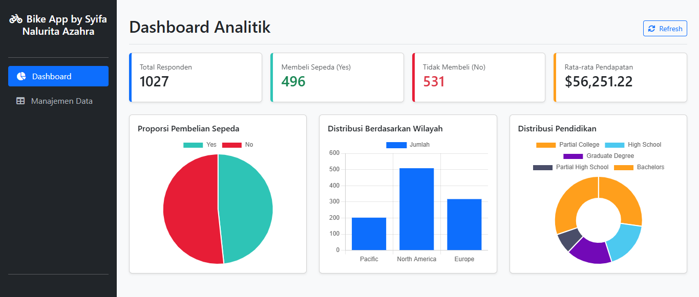

# Bike Sales Dashboard 🚴‍♂️📊

Proyek ini adalah dashboard analisis data interaktif yang dirancang untuk melacak, menganalisis, dan menyajikan performa penjualan produk sepeda secara *real-time*. Menggabungkan kekuatan pengolahan data **Google Sheets** dan otomatisasi tingkat lanjut menggunakan **Google Apps Script**, proyek ini mengubah data transaksi mentah menjadi wawasan bisnis (*business insights*) yang siap pakai untuk pengambilan keputusan.

---

## 💻 Tampilan Dashboard

Berikut adalah cuplikan visualisasi dan tata letak dari dashboard Bike Sales:

  
   
  <em>Gambar 1.1: Bike Sales Dashboard Screenshot.</em>

v
   
  <em>Gambar 1.2: Bike Sales Manajemen Data Screenshot.</em>

---

## 🔍 Deskripsi & Analisis Data

Dashboard ini melakukan agregasi data dari ribuan baris transaksi penjualan untuk menjawab pertanyaan bisnis utama, seperti:
* **Performa Keuangan:** Memantau metrik utama (*Key Performance Indicators*) secara instan, termasuk **Total Revenue**, **Total Profit**, dan **Profit Margin**.
* **Tren & Musiman:** Grafik garis yang menunjukkan fluktuasi penjualan dari bulan ke bulan untuk mengidentifikasi masa-masa puncak (*peak season*).
* **Analisis Produk:** Grafik batang yang memetakan kategori produk paling laris (misal: *Mountain Bikes, Road Bikes, Accessories*) dan kontribusinya terhadap keuntungan.
* **Demografi & Geografis:** Analisis segmentasi pasar berdasarkan wilayah negara pembeli serta kelompok usia pelanggan.

---

## ⚙️ Peran Otomatisasi Google Apps Script

Bagian inti dari efisiensi dashboard ini digerakkan oleh skrip kustom **Google Apps Script** (berbasis JavaScript) yang berjalan di latar belakang. Fungsi utamanya meliputi:

* **Pembersihan Data Otomatis (*Data Cleansing*):** Skrip secara otomatis mendeteksi dan memperbaiki data yang hilang (*missing values*), menghapus duplikat, dan menyetarakan format tanggal atau mata uang saat data baru dimasukkan.
* **Kalkulasi Metrik Dinamis:** Memproses rumus kompleks dan pengelompokan data (seperti kategori usia pelanggan) secara otomatis tanpa membebani performa formula bawaan *cell* spreadsheet.
* **Pemicu Berdasarkan Waktu (*Time-driven Triggers*):** Mengatur pembaruan visualisasi secara berkala agar dashboard selalu menampilkan data paling mutakhir secara otomatis.

---

## 🛠️ Teknologi yang Digunakan

* **Google Sheets:** Digunakan sebagai *database* relasional mini, mesin pemroses tabel pivot (*Pivot Tables*), dan penyusun komponen visual (grafik & diagram).
* **Google Apps Script:** Digunakan sebagai *backend engine* untuk otomatisasi alur kerja, validasi data, dan manipulasi data yang dinamis.
* **Slicers & Filters:** Fitur interaktif yang memungkinkan pengguna menyaring data berdasarkan tahun, negara, atau kategori produk hanya dengan satu klik.

---

## 👤 Kontributor

*Syifa Nalurita Azahra* - *[GitHub Profile](https://github.com/syifanaluritaa)*
 
*link : https://script.google.com/macros/s/AKfycbzcQ4Wh1oWrC9KYOozF5dVfGe9Nqll67DYQ9GtnWA3trDh-oueNtFwDREG3y57SeKjPog/exec*

---
